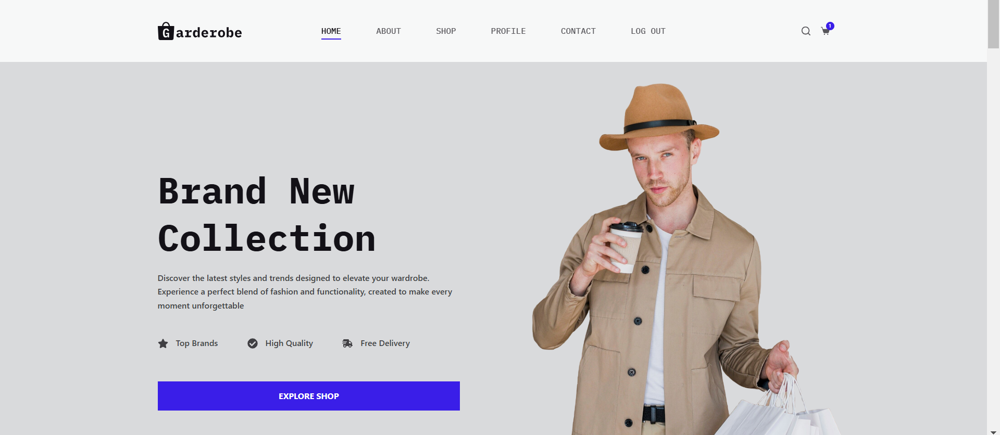
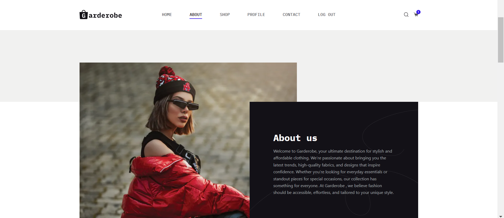
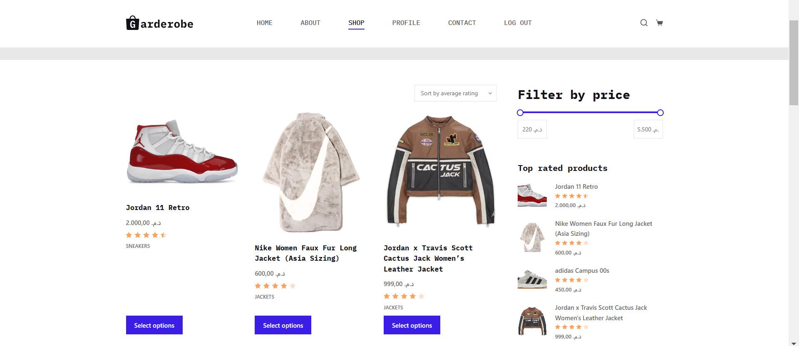
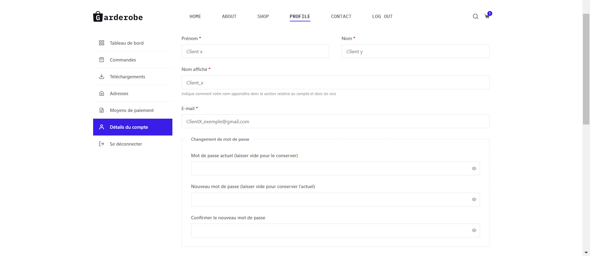
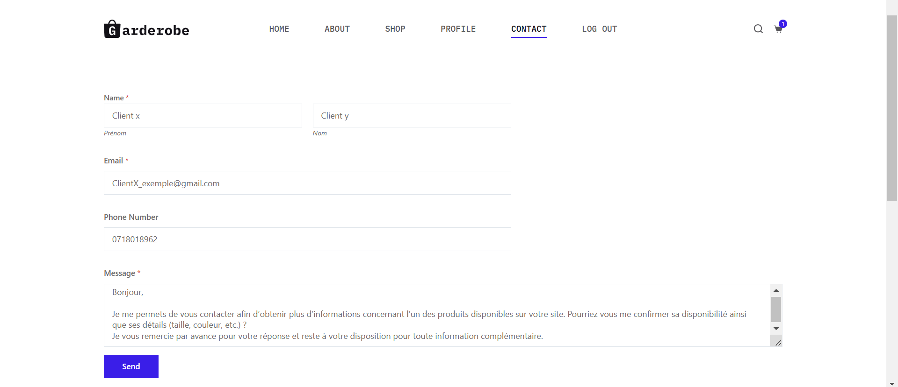
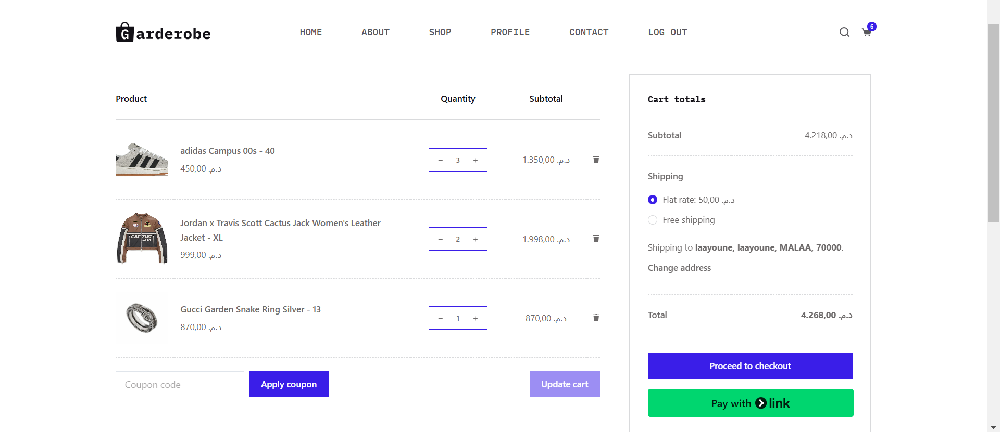
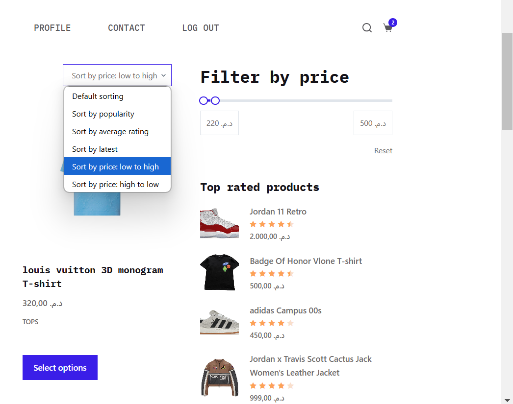
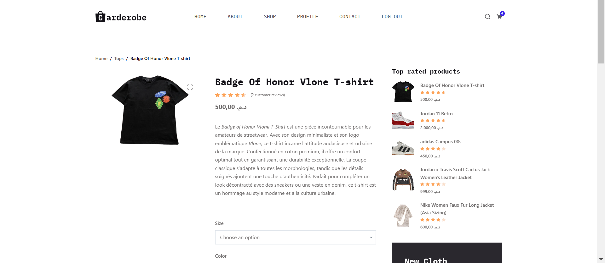
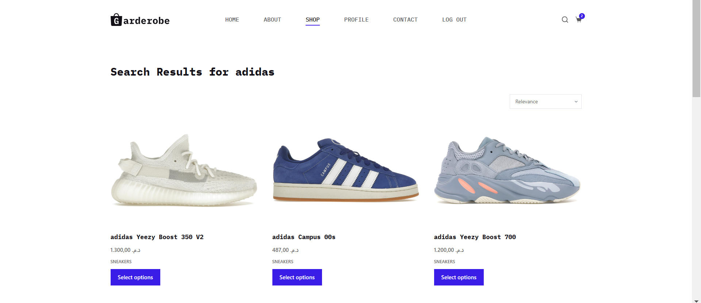

# README.md – Boutique E-commerce - Mode et accessoires

## 📋 Description du projet
Ce projet consiste en la création d'une boutique en ligne utilisant WordPress et WooCommerce. La boutique propose des produits organisés en catégories, une expérience utilisateur fluide et des fonctionnalités avancées comme les filtres de recherche, tri des produits, et pagination optimisée.

---

## 🚀 Fonctionnalités principales
- Création de catégories de produits (T-shirts, Sneakers, etc.).
- Définition des attributs et variations des produits (taille, couleur).
- Filtres de recherche avancés.
- Tri des produits par prix, popularité, etc.
- Pagination optimisée pour une meilleure navigation.
- Expérience utilisateur améliorée grâce à un design responsive.

---

## 🛠 Instructions d'installation

### Prérequis
Avant d'installer le projet, assurez-vous d'avoir :
- Un serveur local comme XAMPP ou WAMP.
- Une base de données configurée.

---

### Étapes d'installation

1. Télécharger le projet  
   Clonez le projet depuis le dépôt GitHub :  
   bash
   git clone https://github.com/OmarMSIID/wp_ecommerce.git
   

2. Configurer la base de données  
   - Créez une nouvelle base de données dans votre serveur SQL(wp_eccommerce).  
   - Importez le fichier wp_ecommerce(5).sql inclus dans le projet "SQL/wp_ecommerce (5).sql"
3. Emplacement 
   - Déplacez le projet dans le répertoire htdocs (XAMPP) ou www (WAMP).  
   - Accédez à votre site via http:8080//localhost/wp_ecommerce.  
4. Importer les produits  
   Utilisez l'outil d'importation WooCommerce pour ajouter les produits fournis dans le fichier products.csv inclus dans le projet.

5. Configurer les paramètres  
   - Rendez-vous dans WooCommerce > Réglages pour configurer les paiements, expéditions et taxes.

---

## 🔑 Identifiants administrateur principal

L'administrateur principal permet d'accéder au tableau de bord WordPress pour gérer le site. Voici les identifiants requis :  

- URL du tableau de bord : http://localhost:8080/wp_ecommerce/wp-admin/  
- Nom d'utilisateur : root  
- Mot de passe : root  

---

## 🎨 Personnalisation
Pour modifier le thème ou ajouter des fonctionnalités :
1. Allez dans Apparence > Personnaliser.
2. Editez les fichiers CSS/JS dans le répertoire /wp-content/themes/blocksy-child.

---

## ✅ Démonstration
Voici quelques captures d'écran illustrant les fonctionnalités du projet :  
- **Page d'accueil** 

- **À propos**  

- **Boutique**  

- **Profil utilisateur**  

- **Page de contact**  

- **Panier**  

- **Filtrage des produits**  

- **Détails du produit**  

- **Recherche de produits**  

- **Tri des produits**  

---

## 🤝 Contributeurs
- Chammakh Ayoub  
- Msiid Omar
- Fatima Zahrae BEN HAMMADI

---

## 📧 Contact
Si vous rencontrez des problèmes, contactez-nous à :  
'Chamm.Ayoub@gmail.com' ou 'omar.bhai2015@gmail.com'

---